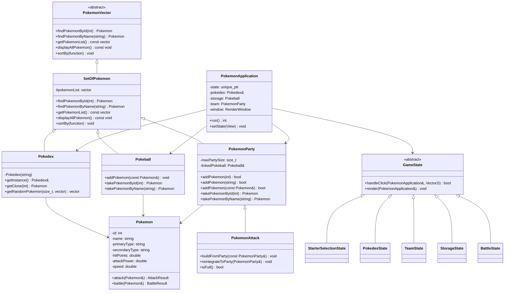

# Pokemon C++

An educational Pokemon collection and battle game written in C++17 with SFML 3. The application provides a graphical interface for choosing Pokemon, managing a team and PC storage, browsing the Pokedex, and battling randomly generated opponents.

## Overview

This project applies several advanced object-oriented C++ concepts:

- inheritance and polymorphism,
- singleton for the Pokemon database,
- state machine for screen navigation,
- composition and collections of Pokemon,
- type, stat, and damage calculations,
- graphical interface with SFML 3.

## Features

- Pokedex data loaded from `ressources/pokedex.csv`
- Choose 10 Pokemon from random groups of three at the start
- Build a team of up to 6 by transferring Pokemon between the PC and team (exactly 6 are required to battle)
- Battle randomly selected teams of 6 opponents
- Claim one opponent Pokemon after defeating the full enemy team
- Type effectiveness multipliers in battle
- Mouse-driven interface with separate states for each screen

## Class diagram



## Software architecture

The game engine is centered on `PokemonApplication`, which coordinates:

- screen states (`GameState` and its subclasses),
- access to the unique Pokedex,
- PC storage and player team management,
- SFML rendering,
- battle logic.

The state machine clearly separates the logic of each view:

- starter selection,
- Pokedex,
- team,
- storage,
- battle.

`GameState` defines the common interface for mouse clicks and rendering. `StarterSelectionState`, `PokedexState`, `TeamState`, `StorageState`, and `BattleState` implement the behavior of their respective screens. `PokemonVector` and `SetOfPokemon` provide a shared interface and implementation for Pokemon collections.

## Requirements

- CMake 3.21 or newer
- C++17-compatible compiler
- SFML 3 (`Graphics`, `Window`, `System`)
- A system font supported by the application (Segoe UI or Arial on Windows)

## Installation and build

Install SFML 3 and make it discoverable by CMake, then run these commands from the project root:

```bash
cmake -S . -B build
cmake --build build
```

On Windows, launch the executable from the project root so the application can find the CSV and sprite resources:

```powershell
.\build\Pokemon.exe
```

The application searches for `ressources/pokedex.csv` and Pokemon sprites relative to the current directory and its parent directories. It currently searches Windows system font folders for Segoe UI or Arial.

## Controls

- Left mouse button: navigate menus, select Pokemon, manage the team, and control battles
- Mouse wheel: browse the Pokedex and PC storage lists
- Window close button: quit

## Project structure

```text
Pokemon_C++
├── Include/
│   ├── Display.hpp
│   ├── GameState.hpp
│   ├── Pokeball.hpp
│   ├── Pokedex.hpp
│   ├── Pokemon.hpp
│   ├── PokemonApplication.hpp
│   ├── PokemonAttack.hpp
│   ├── PokemonParty.hpp
│   ├── PokemonVector.hpp
│   ├── SetOfPokemon.hpp
│   ├── TypeChart.hpp
│   └── ...
├── Src/
│   ├── Display.cpp
│   ├── GameState.cpp
│   ├── main.cpp
│   ├── PokemonApplication.cpp
│   ├── PokemonApplicationDrawing.cpp
│   ├── PokemonApplicationFlow.cpp
│   ├── Pokemon.cpp
│   ├── PokemonAttack.cpp
│   ├── Pokedex.cpp
│   ├── PokemonParty.cpp
│   ├── Pokeball.cpp
│   ├── SetOfPokemon.cpp
│   ├── TypeChart.cpp
│   └── ...
├── ressources/
│   ├── pokedex.csv
│   ├── fonts/             # Optional font fallback
│   └── pokemon/            # Pokemon sprites
├── CMakeLists.txt
├── Readme.md
└── .gitignore
```

## C++ concepts used

- polymorphism via `PokemonVector` and `SetOfPokemon`
- singleton `Pokedex::getInstance()`
- State pattern with `GameState` and its sub-states
- STL containers, algorithms, iterators, and lambdas
- random generation and type-effectiveness calculation
- smart pointers (`std::unique_ptr`) for the active game state
- exception handling at startup

## Project status

This is an academic project. No license file is currently included in the repository.
